# System design (diagrams)

This page explains the system with pictures. It has three parts:

- **Part 1, HLD (high-level design):** the boxes and arrows. Who talks to
  whom, where things run, and how data moves.
- **Part 2, LLD (low-level design):** the modules, classes and methods inside
  the API, and who creates whom.
- **Part 3, flows:** what happens, step by step, when the server starts and
  when a request comes in.

Every name in these diagrams (classes, methods, numbers) is taken from the
code in `src/`. [`ARCHITECTURE.md`](ARCHITECTURE.md) has the same design in
words, plus one request followed line by line.

| I want to understand... | Go to |
|---|---|
| The whole system on one page | [1.1 System context](#11-system-context) |
| What runs where in production | [1.2 Deployment and CI/CD](#12-deployment-and-cicd) |
| The layers inside the API | [1.3 Inside the API](#13-inside-the-api-layers) |
| Which file imports which | [2.1 Module map](#21-module-map) |
| Who creates which object at startup | [2.2 Object wiring](#22-object-wiring-at-startup-composition-root) |
| The classes and their methods | [2.3](#23-classes-portal-adapter) to [2.6](#26-domain-model) |
| What `npm run dev` does | [3.1 Startup](#31-startup-npm-run-dev) |
| What happens on `GET /v1/meters` | [3.2](#32-the-express-pipeline-every-request) and [3.3](#33-get-v1meters-catalog-route) |
| How readings are fetched and cached | [3.5](#35-get-v1metersidreadings-readings-route) and [3.6](#36-ttlcachegetorload) |
| How a portal call is retried | [3.7 PortalClient.get](#37-portalclientget-limiter-breaker-retries) |
| How errors become HTTP answers | [3.11 Error mapping](#311-error-mapping) |

---

## Part 1: HLD

### 1.1 System context

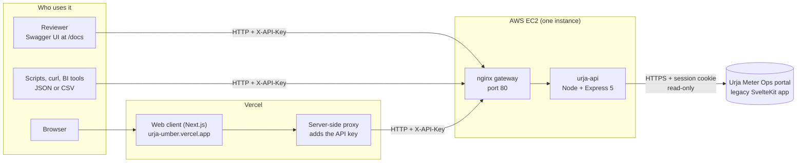
```mermaid
flowchart LR
  subgraph users["Who uses it"]
    rev["Reviewer<br/>Swagger UI at /docs"]
    cli["Scripts, curl, BI tools<br/>JSON or CSV"]
    browser["Browser"]
  end

  subgraph vercel["Vercel"]
    web["Web client (Next.js)<br/>urja-umber.vercel.app"]
    proxy["Server-side proxy<br/>adds the API key"]
    web --> proxy
  end

  subgraph ec2["AWS EC2 (one instance)"]
    nginx["nginx gateway<br/>port 80"]
    api["urja-api<br/>Node + Express 5"]
    nginx --> api
  end

  portal[("Urja Meter Ops portal<br/>legacy SvelteKit app")]

  browser --> web
  rev -->|"HTTP + X-API-Key"| nginx
  cli -->|"HTTP + X-API-Key"| nginx
  proxy -->|"HTTP + X-API-Key"| nginx
  api -->|"HTTPS + session cookie<br/>read-only"| portal
```

What to notice:

- Consumers only ever see **our** API and **our** API keys. The portal
  account stays inside `urja-api`.
- The browser never sees an API key. The Next.js proxy adds it on the server.
- The portal is only ever **read**. Nothing we do changes data there.

### 1.2 Deployment and CI/CD

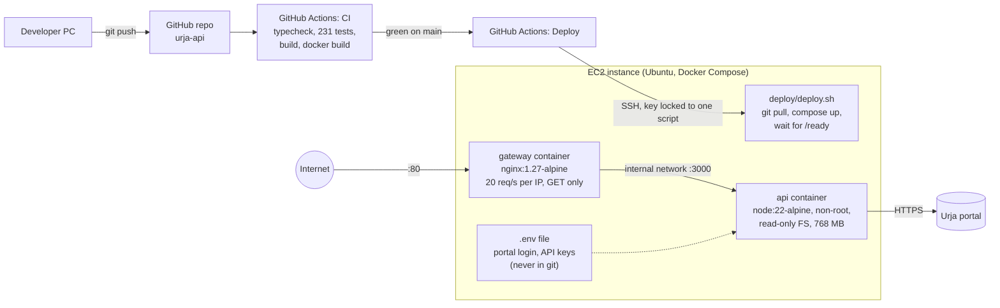
```mermaid
flowchart LR
  dev["Developer PC"] -->|git push| gh["GitHub repo<br/>urja-api"]
  gh --> ci["GitHub Actions: CI<br/>typecheck, 231 tests,<br/>build, docker build"]
  ci -->|"green on main"| cd["GitHub Actions: Deploy"]
  cd -->|"SSH, key locked to one script"| deploy["deploy/deploy.sh<br/>git pull, compose up,<br/>wait for /ready"]

  subgraph ec2["EC2 instance (Ubuntu, Docker Compose)"]
    deploy
    gw["gateway container<br/>nginx:1.27-alpine<br/>20 req/s per IP, GET only"]
    apic["api container<br/>node:22-alpine, non-root,<br/>read-only FS, 768 MB"]
    env[".env file<br/>portal login, API keys<br/>(never in git)"]
    gw -->|"internal network :3000"| apic
    env -.-> apic
  end

  internet((Internet)) -->|":80"| gw
  apic -->|HTTPS| portal[("Urja portal")]
```

What to notice:

- Only nginx publishes a port (80). Port 3000 is closed to the outside.
- A push to `main` deploys only if every test passes.
- Secrets live in `.env` on the server, not in the image and not in git.

### 1.3 Inside the API (layers)

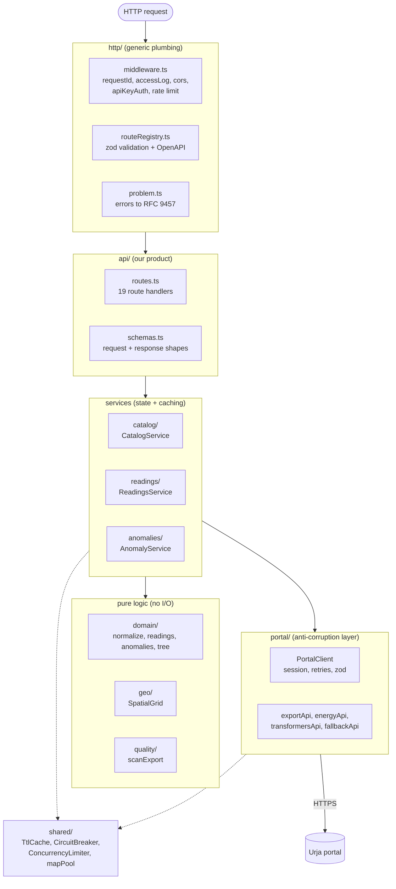
```mermaid
flowchart TB
  req(["HTTP request"]) --> http

  subgraph http["http/ (generic plumbing)"]
    mw["middleware.ts<br/>requestId, accessLog, cors,<br/>apiKeyAuth, rate limit"]
    reg["routeRegistry.ts<br/>zod validation + OpenAPI"]
    prob["problem.ts<br/>errors to RFC 9457"]
  end

  subgraph api["api/ (our product)"]
    routes["routes.ts<br/>19 route handlers"]
    schemas["schemas.ts<br/>request + response shapes"]
  end

  subgraph services["services (state + caching)"]
    cat["catalog/<br/>CatalogService"]
    rd["readings/<br/>ReadingsService"]
    an["anomalies/<br/>AnomalyService"]
  end

  subgraph pure["pure logic (no I/O)"]
    dom["domain/<br/>normalize, readings, anomalies, tree"]
    geo["geo/<br/>SpatialGrid"]
    q["quality/<br/>scanExport"]
  end

  subgraph portal["portal/ (anti-corruption layer)"]
    pc["PortalClient<br/>session, retries, zod"]
    apis["exportApi, energyApi,<br/>transformersApi, fallbackApi"]
  end

  shared["shared/<br/>TtlCache, CircuitBreaker,<br/>ConcurrencyLimiter, mapPool"]

  http --> api --> services
  services --> pure
  services --> portal
  services -.-> shared
  portal -.-> shared
  portal -->|HTTPS| up[("Urja portal")]
```

The rule: arrows only point **down**. `domain/` never imports Express or
`fetch`. Only `portal/` knows the portal's strange formats.

### 1.4 Two kinds of data, two strategies

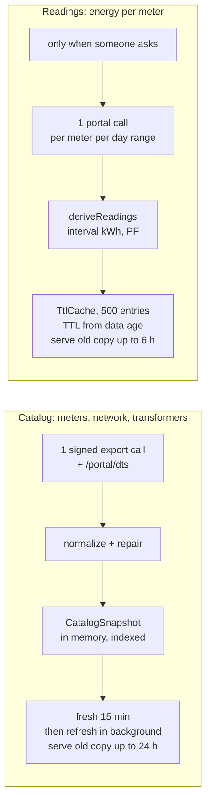
```mermaid
flowchart LR
  subgraph catalog["Catalog: meters, network, transformers"]
    c1["1 signed export call<br/>+ /portal/dts"] --> c2["normalize + repair"] --> c3["CatalogSnapshot<br/>in memory, indexed"]
    c3 --> c4["fresh 15 min<br/>then refresh in background<br/>serve old copy up to 24 h"]
  end

  subgraph readings["Readings: energy per meter"]
    r1["only when someone asks"] --> r2["1 portal call<br/>per meter per day range"] --> r3["deriveReadings<br/>interval kWh, PF"]
    r3 --> r4["TtlCache, 500 entries<br/>TTL from data age<br/>serve old copy up to 6 h"]
  end
```

The catalog is small (403 meters, under 1 MB), so it is loaded whole. Readings
are bigger and mostly never looked at, so they are fetched on demand.

---

## Part 2: LLD

### 2.1 Module map

Which file uses which. Arrows mean "imports and calls".

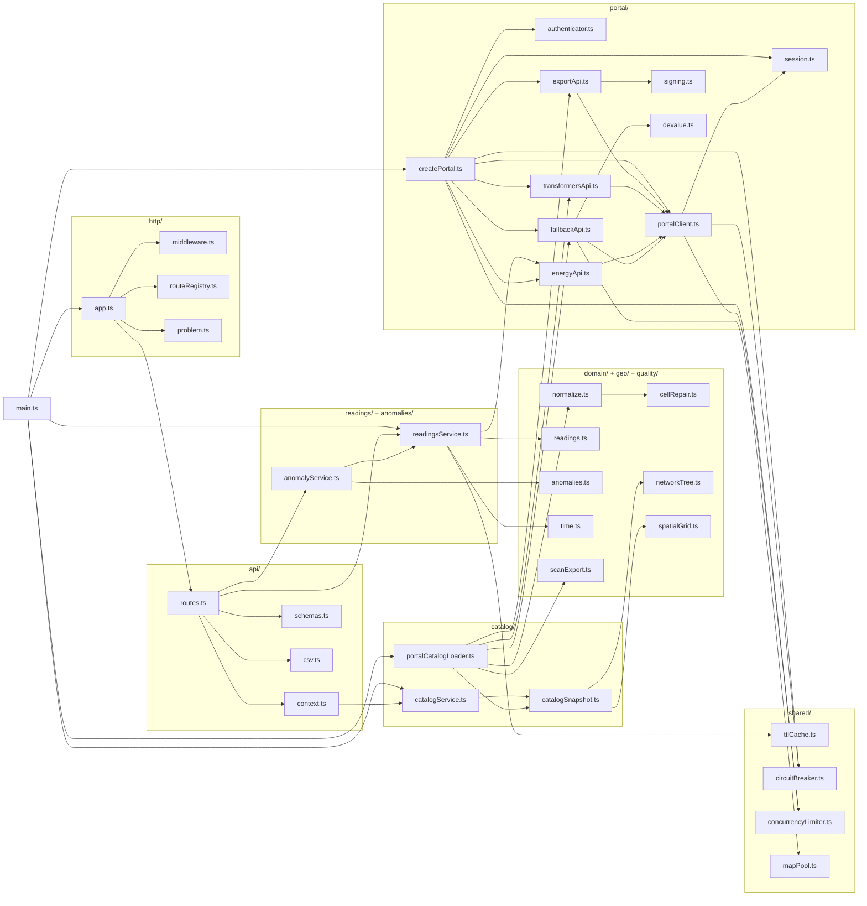
```mermaid
flowchart LR
  main["main.ts"]

  subgraph HTTP["http/"]
    app["app.ts"]
    mw["middleware.ts"]
    reg["routeRegistry.ts"]
    prob["problem.ts"]
  end

  subgraph API["api/"]
    routes["routes.ts"]
    ctx["context.ts"]
    sch["schemas.ts"]
    csv["csv.ts"]
  end

  subgraph CAT["catalog/"]
    cs["catalogService.ts"]
    snap["catalogSnapshot.ts"]
    loader["portalCatalogLoader.ts"]
  end

  subgraph RD["readings/ + anomalies/"]
    rs["readingsService.ts"]
    as["anomalyService.ts"]
  end

  subgraph DOM["domain/ + geo/ + quality/"]
    norm["normalize.ts"]
    cell["cellRepair.ts"]
    tree["networkTree.ts"]
    rdg["readings.ts"]
    ano["anomalies.ts"]
    time["time.ts"]
    grid["spatialGrid.ts"]
    scan["scanExport.ts"]
  end

  subgraph PORTAL["portal/"]
    cp["createPortal.ts"]
    auth["authenticator.ts"]
    sess["session.ts"]
    pcl["portalClient.ts"]
    exp["exportApi.ts"]
    sign["signing.ts"]
    dts["transformersApi.ts"]
    en["energyApi.ts"]
    fb["fallbackApi.ts"]
    dv["devalue.ts"]
  end

  subgraph SH["shared/"]
    ttl["ttlCache.ts"]
    cb["circuitBreaker.ts"]
    lim["concurrencyLimiter.ts"]
    pool["mapPool.ts"]
  end

  main --> app & cp & cs & loader & rs
  app --> mw & reg & prob & routes
  routes --> ctx & sch & csv & as
  ctx --> cs
  routes --> rs
  cs --> snap
  loader --> norm & scan & snap
  loader --> exp & dts & fb
  snap --> tree & grid
  norm --> cell
  rs --> ttl & rdg & time
  rs --> en
  as --> ano & rs
  cp --> auth & sess & pcl & exp & dts & en & fb & cb & lim
  pcl --> sess & cb & lim
  exp --> sign & pcl
  dts --> pcl
  en --> pcl
  fb --> dv & pcl & pool
```

### 2.2 Object wiring at startup (composition root)

`main.ts` is the only place that creates real objects. Everything else gets
its dependencies passed in through the constructor, which is why tests can
swap in a fake portal and a fake clock.

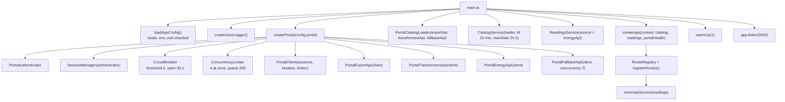
```mermaid
flowchart TB
  main["main.ts"] --> cfg["loadAppConfig()<br/>reads .env, zod-checked"]
  main --> log["createJsonLogger()"]
  main --> cp["createPortal(config.portal)"]

  cp --> au["PortalAuthenticator"]
  cp --> sm["SessionManager(authenticator)"]
  cp --> br["CircuitBreaker<br/>threshold 5, open 30 s"]
  cp --> li["ConcurrencyLimiter<br/>4 at once, queue 200"]
  cp --> pc["PortalClient(sessions, breaker, limiter)"]
  cp --> ex["PortalExportApi(client)"]
  cp --> tr["PortalTransformersApi(client)"]
  cp --> en["PortalEnergyApi(client)"]
  cp --> fb["PortalFallbackApi(client, concurrency 2)"]

  main --> ld["PortalCatalogLoader(exportApi, transformersApi, fallbackApi)"]
  main --> cs["CatalogService(loader, ttl 15 min, maxStale 24 h)"]
  main --> rs["ReadingsService(source = energyApi)"]
  main --> app["createApp(context: catalog, readings, portalHealth)"]
  app --> rr["RouteRegistry + registerRoutes()"]
  rr --> as["AnomalyService(readings)"]
  main --> warm["warmUp(1)"]
  main --> listen["app.listen(3000)"]
```

### 2.3 Classes: portal adapter

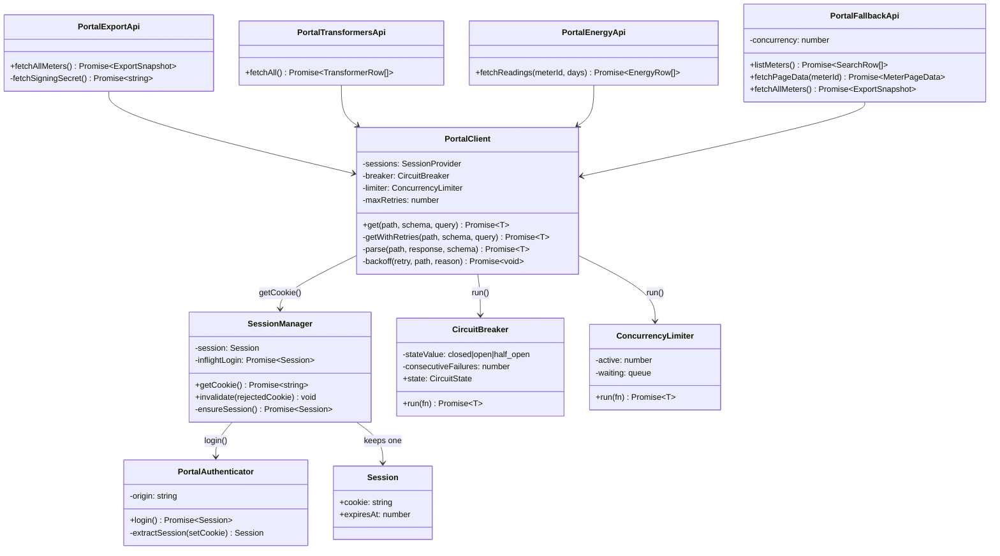
```mermaid
classDiagram
  class PortalAuthenticator {
    -origin: string
    +login() Promise~Session~
    -extractSession(setCookie) Session
  }
  class SessionManager {
    -session: Session
    -inflightLogin: Promise~Session~
    +getCookie() Promise~string~
    +invalidate(rejectedCookie) void
    -ensureSession() Promise~Session~
  }
  class Session {
    +cookie: string
    +expiresAt: number
  }
  class PortalClient {
    -sessions: SessionProvider
    -breaker: CircuitBreaker
    -limiter: ConcurrencyLimiter
    -maxRetries: number
    +get(path, schema, query) Promise~T~
    -getWithRetries(path, schema, query) Promise~T~
    -parse(path, response, schema) Promise~T~
    -backoff(retry, path, reason) Promise~void~
  }
  class PortalExportApi {
    +fetchAllMeters() Promise~ExportSnapshot~
    -fetchSigningSecret() Promise~string~
  }
  class PortalTransformersApi {
    +fetchAll() Promise~TransformerRow[]~
  }
  class PortalEnergyApi {
    +fetchReadings(meterId, days) Promise~EnergyRow[]~
  }
  class PortalFallbackApi {
    -concurrency: number
    +listMeters() Promise~SearchRow[]~
    +fetchPageData(meterId) Promise~MeterPageData~
    +fetchAllMeters() Promise~ExportSnapshot~
  }
  class CircuitBreaker {
    -stateValue: closed|open|half_open
    -consecutiveFailures: number
    +state: CircuitState
    +run(fn) Promise~T~
  }
  class ConcurrencyLimiter {
    -active: number
    -waiting: queue
    +run(fn) Promise~T~
  }

  SessionManager --> PortalAuthenticator : login()
  SessionManager --> Session : keeps one
  PortalClient --> SessionManager : getCookie()
  PortalClient --> CircuitBreaker : run()
  PortalClient --> ConcurrencyLimiter : run()
  PortalExportApi --> PortalClient
  PortalTransformersApi --> PortalClient
  PortalEnergyApi --> PortalClient
  PortalFallbackApi --> PortalClient
```

The portal errors, and what each one means:

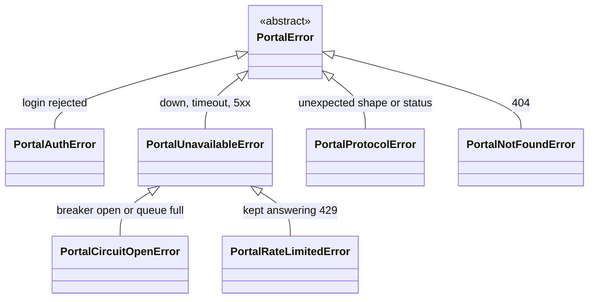
```mermaid
classDiagram
  class PortalError { <<abstract>> }
  PortalError <|-- PortalAuthError : login rejected
  PortalError <|-- PortalUnavailableError : down, timeout, 5xx
  PortalUnavailableError <|-- PortalCircuitOpenError : breaker open or queue full
  PortalUnavailableError <|-- PortalRateLimitedError : kept answering 429
  PortalError <|-- PortalProtocolError : unexpected shape or status
  PortalError <|-- PortalNotFoundError : 404
```

### 2.4 Classes: services and shared tools

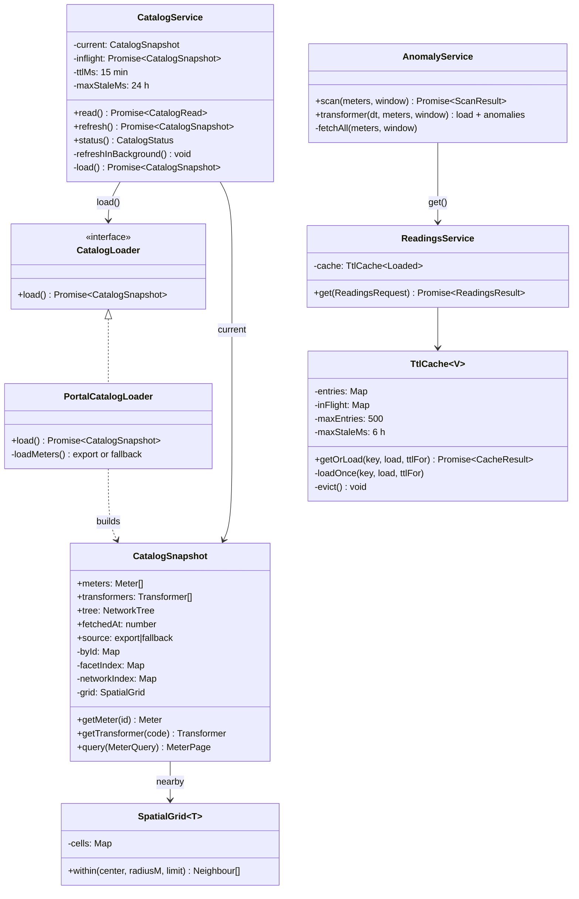
```mermaid
classDiagram
  class CatalogService {
    -current: CatalogSnapshot
    -inflight: Promise~CatalogSnapshot~
    -ttlMs: 15 min
    -maxStaleMs: 24 h
    +read() Promise~CatalogRead~
    +refresh() Promise~CatalogSnapshot~
    +status() CatalogStatus
    -refreshInBackground() void
    -load() Promise~CatalogSnapshot~
  }
  class CatalogLoader {
    <<interface>>
    +load() Promise~CatalogSnapshot~
  }
  class PortalCatalogLoader {
    +load() Promise~CatalogSnapshot~
    -loadMeters() export or fallback
  }
  class CatalogSnapshot {
    +meters: Meter[]
    +transformers: Transformer[]
    +tree: NetworkTree
    +fetchedAt: number
    +source: export|fallback
    -byId: Map
    -facetIndex: Map
    -networkIndex: Map
    -grid: SpatialGrid
    +getMeter(id) Meter
    +getTransformer(code) Transformer
    +query(MeterQuery) MeterPage
  }
  class ReadingsService {
    -cache: TtlCache~Loaded~
    +get(ReadingsRequest) Promise~ReadingsResult~
  }
  class AnomalyService {
    +scan(meters, window) Promise~ScanResult~
    +transformer(dt, meters, window) load + anomalies
    -fetchAll(meters, window)
  }
  class TtlCache~V~ {
    -entries: Map
    -inFlight: Map
    -maxEntries: 500
    -maxStaleMs: 6 h
    +getOrLoad(key, load, ttlFor) Promise~CacheResult~
    -loadOnce(key, load, ttlFor)
    -evict() void
  }
  class SpatialGrid~T~ {
    -cells: Map
    +within(center, radiusM, limit) Neighbour[]
  }

  CatalogService --> CatalogLoader : load()
  CatalogLoader <|.. PortalCatalogLoader
  PortalCatalogLoader ..> CatalogSnapshot : builds
  CatalogService --> CatalogSnapshot : current
  CatalogSnapshot --> SpatialGrid : nearby
  ReadingsService --> TtlCache
  AnomalyService --> ReadingsService : get()
```

### 2.5 Classes: HTTP layer

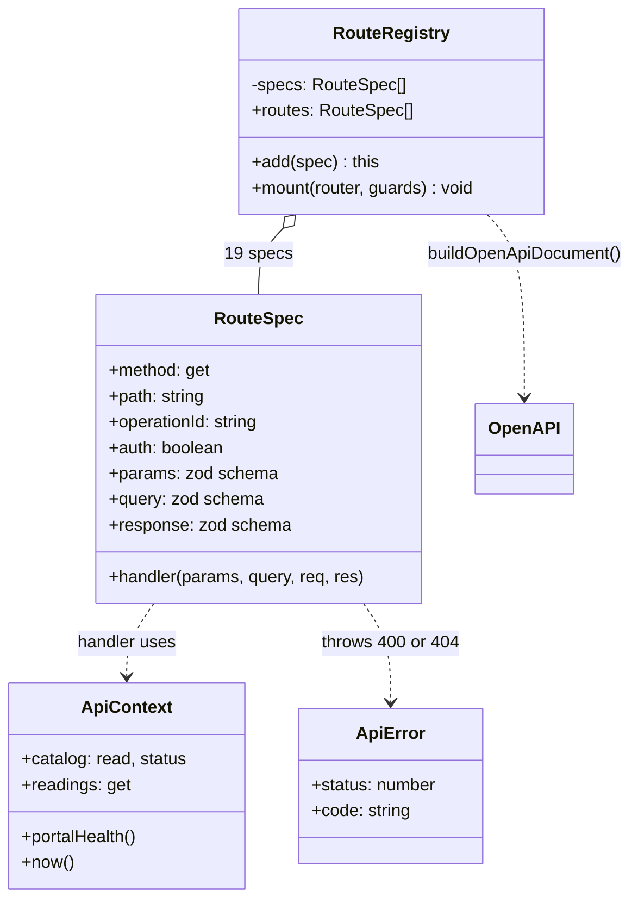
```mermaid
classDiagram
  class RouteRegistry {
    -specs: RouteSpec[]
    +add(spec) this
    +routes: RouteSpec[]
    +mount(router, guards) void
  }
  class RouteSpec {
    +method: get
    +path: string
    +operationId: string
    +auth: boolean
    +params: zod schema
    +query: zod schema
    +response: zod schema
    +handler(params, query, req, res)
  }
  class ApiContext {
    +catalog: read, status
    +readings: get
    +portalHealth()
    +now()
  }
  class ApiError {
    +status: number
    +code: string
  }
  RouteRegistry o-- RouteSpec : 19 specs
  RouteSpec ..> ApiContext : handler uses
  RouteRegistry ..> OpenAPI : buildOpenApiDocument()
  RouteSpec ..> ApiError : throws 400 or 404
```

One `RouteSpec` is used three ways: `mount()` turns it into an Express route
with validation, TypeScript reads the handler's types from its schemas, and
`buildOpenApiDocument()` turns it into the Swagger docs.

### 2.6 Domain model

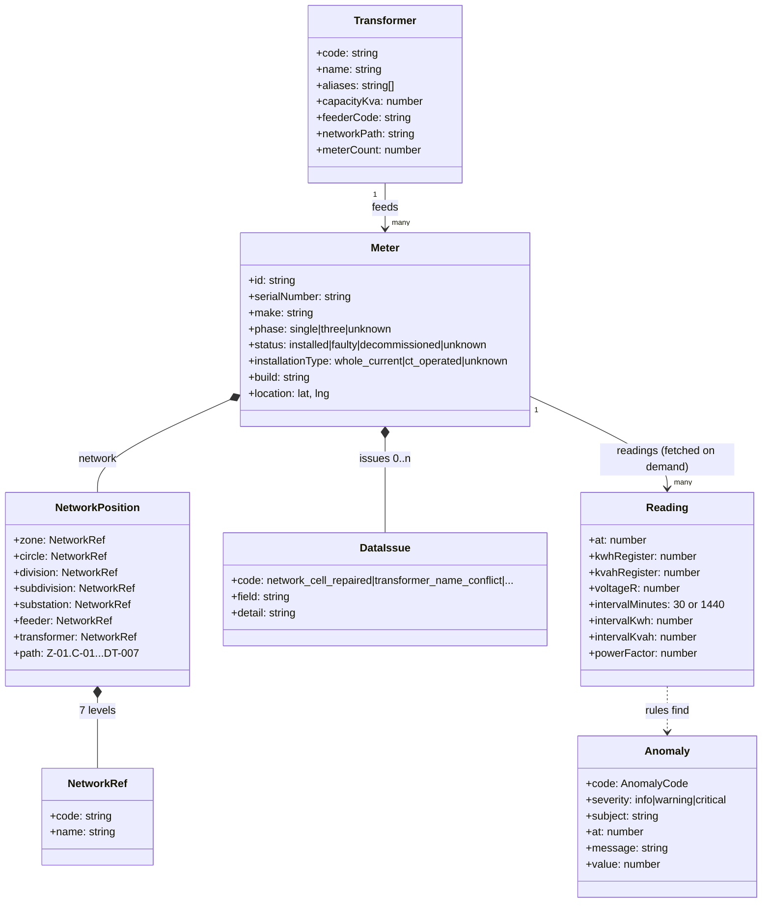
```mermaid
classDiagram
  class Meter {
    +id: string
    +serialNumber: string
    +make: string
    +phase: single|three|unknown
    +status: installed|faulty|decommissioned|unknown
    +installationType: whole_current|ct_operated|unknown
    +build: string
    +location: lat, lng
  }
  class NetworkPosition {
    +zone: NetworkRef
    +circle: NetworkRef
    +division: NetworkRef
    +subdivision: NetworkRef
    +substation: NetworkRef
    +feeder: NetworkRef
    +transformer: NetworkRef
    +path: Z-01.C-01...DT-007
  }
  class NetworkRef {
    +code: string
    +name: string
  }
  class DataIssue {
    +code: network_cell_repaired|transformer_name_conflict|...
    +field: string
    +detail: string
  }
  class Transformer {
    +code: string
    +name: string
    +aliases: string[]
    +capacityKva: number
    +feederCode: string
    +networkPath: string
    +meterCount: number
  }
  class Reading {
    +at: number
    +kwhRegister: number
    +kvahRegister: number
    +voltageR: number
    +intervalMinutes: 30 or 1440
    +intervalKwh: number
    +intervalKvah: number
    +powerFactor: number
  }
  class Anomaly {
    +code: AnomalyCode
    +severity: info|warning|critical
    +subject: string
    +at: number
    +message: string
    +value: number
  }

  Meter *-- NetworkPosition : network
  NetworkPosition *-- NetworkRef : 7 levels
  Meter *-- DataIssue : issues 0..n
  Transformer "1" --> "many" Meter : feeds
  Meter "1" --> "many" Reading : readings (fetched on demand)
  Reading ..> Anomaly : rules find
```

---

## Part 3: Flows

### 3.1 Startup (`npm run dev`)

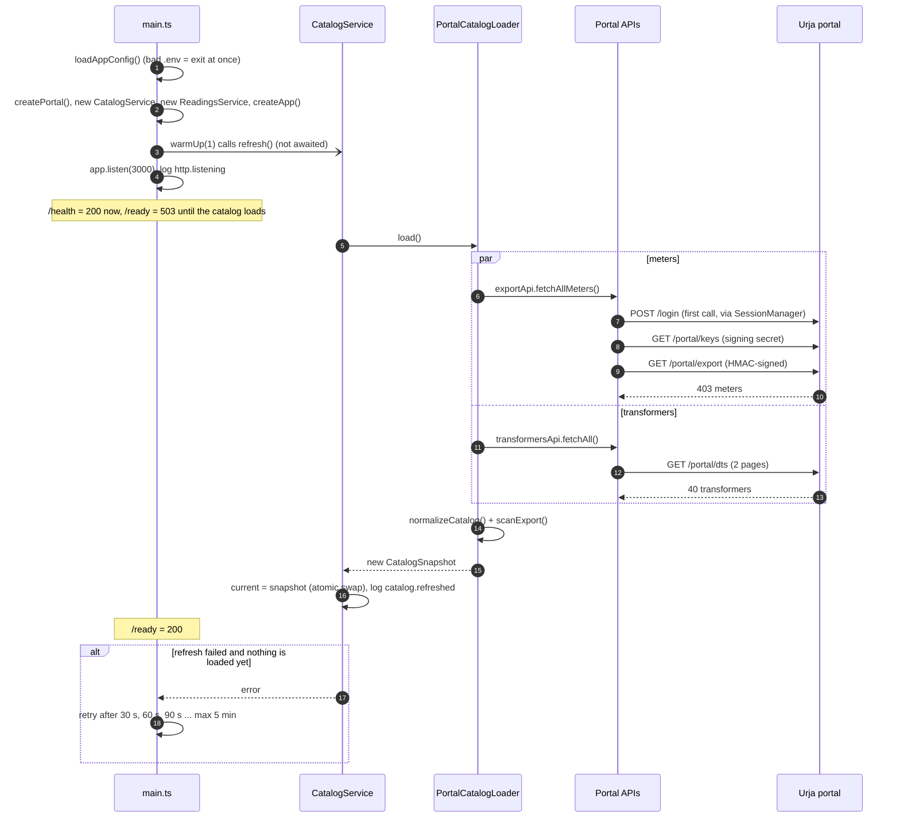
```mermaid
sequenceDiagram
  autonumber
  participant M as main.ts
  participant CS as CatalogService
  participant L as PortalCatalogLoader
  participant P as Portal APIs
  participant U as Urja portal

  M->>M: loadAppConfig() (bad .env = exit at once)
  M->>M: createPortal(), new CatalogService, new ReadingsService, createApp()
  M-)CS: warmUp(1) calls refresh() (not awaited)
  M->>M: app.listen(3000), log http.listening
  Note over M: /health = 200 now, /ready = 503 until the catalog loads
  CS->>L: load()
  par meters
    L->>P: exportApi.fetchAllMeters()
    P->>U: POST /login (first call, via SessionManager)
    P->>U: GET /portal/keys (signing secret)
    P->>U: GET /portal/export (HMAC-signed)
    U-->>P: 403 meters
  and transformers
    L->>P: transformersApi.fetchAll()
    P->>U: GET /portal/dts (2 pages)
    U-->>P: 40 transformers
  end
  L->>L: normalizeCatalog() + scanExport()
  L-->>CS: new CatalogSnapshot
  CS->>CS: current = snapshot (atomic swap), log catalog.refreshed
  Note over M: /ready = 200
  alt refresh failed and nothing is loaded yet
    CS-->>M: error
    M->>M: retry after 30 s, 60 s, 90 s ... max 5 min
  end
```

### 3.2 The Express pipeline (every request)

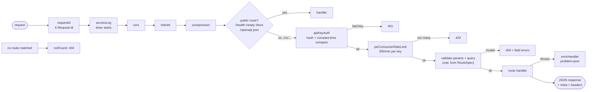
```mermaid
flowchart LR
  in(["request"]) --> a["requestId<br/>X-Request-Id"] --> b["accessLog<br/>timer starts"] --> c["cors"] --> d["helmet"] --> e["compression"]
  e --> pub{"public route?<br/>/health /ready /docs<br/>/openapi.json"}
  pub -->|yes| h1["handler"]
  pub -->|"no, /v1/..."| f["apiKeyAuth<br/>hash + constant-time compare"]
  f -->|bad key| x401["401"]
  f -->|ok| g["perConsumerRateLimit<br/>300/min per key"]
  g -->|too many| x429["429"]
  g -->|ok| v["validate params + query<br/>(zod, from RouteSpec)"]
  v -->|invalid| x400["400 + field errors"]
  v -->|ok| h["route handler"]
  h -->|throws| eh["errorHandler<br/>problem+json"]
  h --> out(["JSON response<br/>+ meta + headers"])
  nf["no route matched"] --> n404["notFound: 404"]
```

Express picks the handler by **method + path** only. The query string
(`?status=faulty`) does not affect which route runs; it is checked later by
zod. That is why `/v1/meters/nearby` is registered before
`/v1/meters/:meterId`, otherwise "nearby" would be read as a meter id.

### 3.3 `GET /v1/meters` (catalog route)

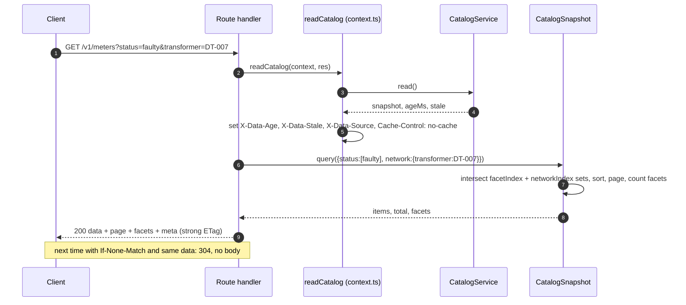
```mermaid
sequenceDiagram
  autonumber
  participant C as Client
  participant R as Route handler
  participant X as readCatalog (context.ts)
  participant CS as CatalogService
  participant S as CatalogSnapshot

  C->>R: GET /v1/meters?status=faulty&transformer=DT-007
  R->>X: readCatalog(context, res)
  X->>CS: read()
  CS-->>X: snapshot, ageMs, stale
  X->>X: set X-Data-Age, X-Data-Stale, X-Data-Source, Cache-Control: no-cache
  R->>S: query({status:[faulty], network:{transformer:DT-007}})
  S->>S: intersect facetIndex + networkIndex sets, sort, page, count facets
  S-->>R: items, total, facets
  R-->>C: 200 data + page + facets + meta (strong ETag)
  Note over C,R: next time with If-None-Match and same data: 304, no body
```

No portal call happens here. The catalog answers from memory.

### 3.4 `CatalogService.read()`

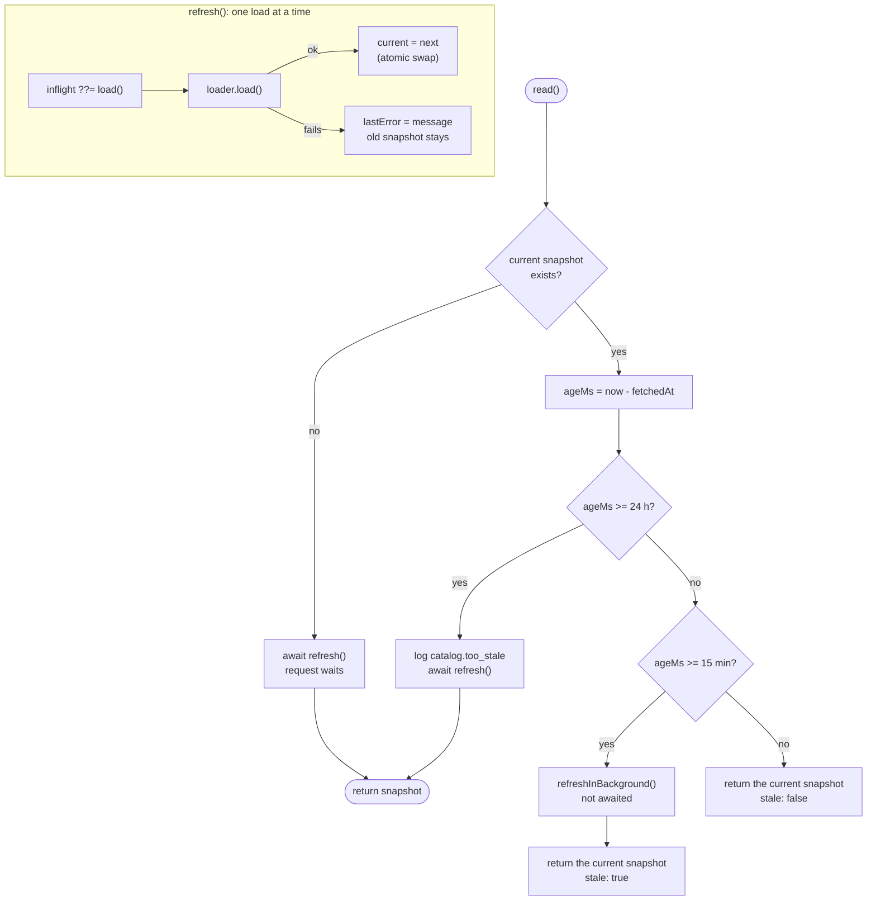
```mermaid
flowchart TB
  s(["read()"]) --> q1{"current snapshot<br/>exists?"}
  q1 -->|no| w1["await refresh()<br/>request waits"] --> r(["return snapshot"])
  q1 -->|yes| age["ageMs = now - fetchedAt"]
  age --> q2{"ageMs >= 24 h?"}
  q2 -->|yes| w2["log catalog.too_stale<br/>await refresh()"] --> r
  q2 -->|no| q3{"ageMs >= 15 min?"}
  q3 -->|yes| bg["refreshInBackground()<br/>not awaited"] --> old["return the current snapshot<br/>stale: true"]
  q3 -->|no| fresh["return the current snapshot<br/>stale: false"]

  subgraph refresh["refresh(): one load at a time"]
    rf1["inflight ??= load()"] --> rf2["loader.load()"]
    rf2 -->|ok| rf3["current = next<br/>(atomic swap)"]
    rf2 -->|fails| rf4["lastError = message<br/>old snapshot stays"]
  end
```

`inflight ??= load()` means: if a load is already running, everyone waits for
that same one. 100 requests at minute 16 cause **one** refresh, not 100.

### 3.5 `GET /v1/meters/{id}/readings` (readings route)

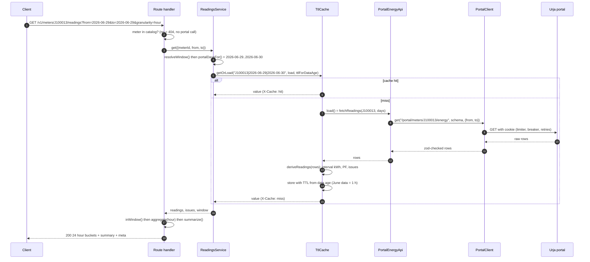
```mermaid
sequenceDiagram
  autonumber
  participant C as Client
  participant R as Route handler
  participant RS as ReadingsService
  participant TC as TtlCache
  participant E as PortalEnergyApi
  participant PC as PortalClient
  participant U as Urja portal

  C->>R: GET /v1/meters/J100013/readings?from=2026-06-29&to=2026-06-29&granularity=hour
  R->>R: meter in catalog? (no = 404, no portal call)
  R->>RS: get({meterId, from, to})
  RS->>RS: resolveWindow() then portalDaysFor() = 2026-06-29..2026-06-30
  RS->>TC: getOrLoad("J100013|2026-06-29|2026-06-30", load, ttlForDataAge)
  alt cache hit
    TC-->>RS: value (X-Cache: hit)
  else miss
    TC->>E: load() = fetchReadings(J100013, days)
    E->>PC: get("/portal/meters/J100013/energy", schema, {from, to})
    PC->>U: GET with cookie (limiter, breaker, retries)
    U-->>PC: raw rows
    PC-->>E: zod-checked rows
    E-->>TC: rows
    TC->>TC: deriveReadings(rows): interval kWh, PF, issues
    TC->>TC: store with TTL from data age (June data = 1 h)
    TC-->>RS: value (X-Cache: miss)
  end
  RS-->>R: readings, issues, window
  R->>R: inWindow() then aggregate(hour) then summarize()
  R-->>C: 200 24 hour buckets + summary + meta
```

### 3.6 `TtlCache.getOrLoad()`

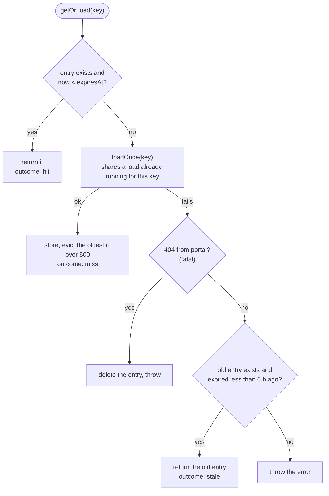
```mermaid
flowchart TB
  s(["getOrLoad(key)"]) --> q1{"entry exists and<br/>now < expiresAt?"}
  q1 -->|yes| hit["return it<br/>outcome: hit"]
  q1 -->|no| lo["loadOnce(key)<br/>shares a load already running for this key"]
  lo -->|ok| miss["store, evict the oldest if over 500<br/>outcome: miss"]
  lo -->|fails| q2{"404 from portal?<br/>(fatal)"}
  q2 -->|yes| del["delete the entry, throw"]
  q2 -->|no| q3{"old entry exists and<br/>expired less than 6 h ago?"}
  q3 -->|yes| stale["return the old entry<br/>outcome: stale"]
  q3 -->|no| thr["throw the error"]
```

### 3.7 `PortalClient.get()` (limiter, breaker, retries)

Every portal call goes through three wrappers, from the outside in:
the **limiter**, the **breaker**, then the **retry loop**.

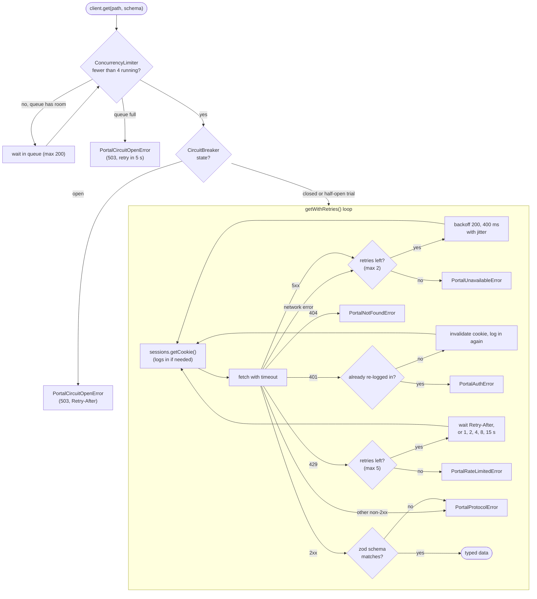
```mermaid
flowchart TB
  s(["client.get(path, schema)"]) --> lim{"ConcurrencyLimiter<br/>fewer than 4 running?"}
  lim -->|"no, queue has room"| wait["wait in queue (max 200)"] --> lim
  lim -->|"queue full"| e503a["PortalCircuitOpenError<br/>(503, retry in 5 s)"]
  lim -->|yes| brk{"CircuitBreaker<br/>state?"}
  brk -->|open| e503b["PortalCircuitOpenError<br/>(503, Retry-After)"]
  brk -->|"closed or half-open trial"| loop

  subgraph loop["getWithRetries() loop"]
    ck["sessions.getCookie()<br/>(logs in if needed)"] --> f["fetch with timeout"]
    f -->|network error| n1{"retries left?<br/>(max 2)"}
    n1 -->|yes| bo["backoff 200, 400 ms<br/>with jitter"] --> ck
    n1 -->|no| eu["PortalUnavailableError"]
    f -->|401| a1{"already re-logged in?"}
    a1 -->|no| inv["invalidate cookie, log in again"] --> ck
    a1 -->|yes| ea["PortalAuthError"]
    f -->|404| enf["PortalNotFoundError"]
    f -->|429| r1{"retries left?<br/>(max 5)"}
    r1 -->|yes| rw["wait Retry-After,<br/>or 1, 2, 4, 8, 15 s"] --> ck
    r1 -->|no| erl["PortalRateLimitedError"]
    f -->|5xx| n1
    f -->|other non-2xx| ep["PortalProtocolError"]
    f -->|2xx| z{"zod schema<br/>matches?"}
    z -->|no| ep
    z -->|yes| ok(["typed data"])
  end
```

The breaker counts only **real health problems** as failures:
`PortalUnavailableError` (but not a 429) and `PortalAuthError`. A 404 or a 429
means the portal is alive, so the breaker stays closed.

### 3.8 Circuit breaker states

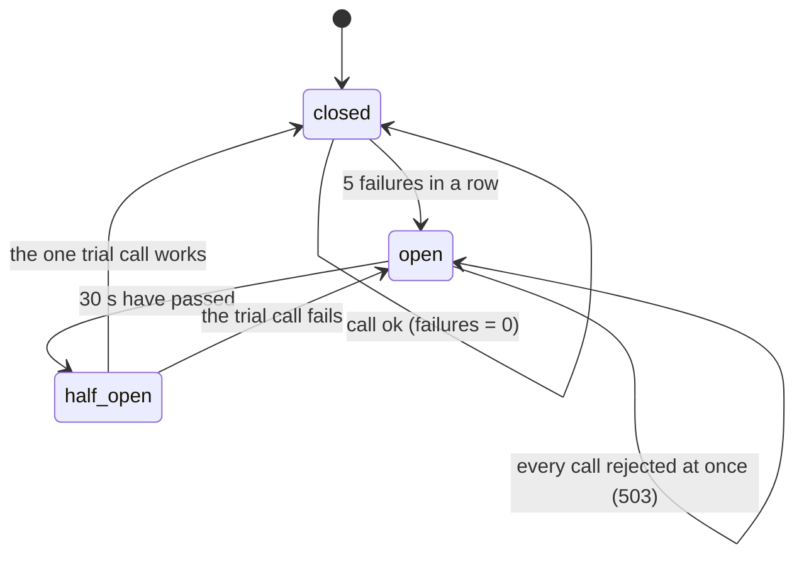
```mermaid
stateDiagram-v2
  [*] --> closed
  closed --> closed: call ok (failures = 0)
  closed --> open: 5 failures in a row
  open --> open: every call rejected at once (503)
  open --> half_open: 30 s have passed
  half_open --> closed: the one trial call works
  half_open --> open: the trial call fails
```

### 3.9 Catalog load: export or fallback

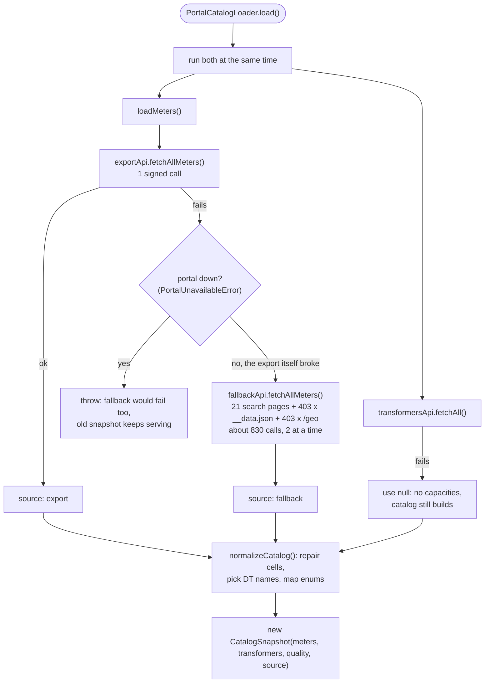
```mermaid
flowchart TB
  s(["PortalCatalogLoader.load()"]) --> par["run both at the same time"]
  par --> m["loadMeters()"]
  par --> t["transformersApi.fetchAll()"]
  t -->|fails| tnull["use null: no capacities,<br/>catalog still builds"]
  m --> ex["exportApi.fetchAllMeters()<br/>1 signed call"]
  ex -->|ok| src1["source: export"]
  ex -->|fails| q{"portal down?<br/>(PortalUnavailableError)"}
  q -->|yes| thr["throw: fallback would fail too,<br/>old snapshot keeps serving"]
  q -->|"no, the export itself broke"| fb["fallbackApi.fetchAllMeters()<br/>21 search pages + 403 x __data.json + 403 x /geo<br/>about 830 calls, 2 at a time"]
  fb --> src2["source: fallback"]
  src1 & src2 & tnull --> norm["normalizeCatalog(): repair cells,<br/>pick DT names, map enums"]
  norm --> snap["new CatalogSnapshot(meters, transformers, quality, source)"]
```

### 3.10 Anomaly scan (`GET /v1/anomalies?transformer=DT-007`)

```mermaid
sequenceDiagram
  autonumber
  participant C as Client
  participant R as Route handler
  participant AS as AnomalyService
  participant RS as ReadingsService
  participant D as domain/anomalies.ts

  C->>R: GET /v1/anomalies?transformer=DT-007&from=...&to=...
  R->>R: snapshot.query(transformer=DT-007) = 13 meters (max 50)
  R->>AS: scan(13 meters, window)
  par one get() per meter (the portal limiter keeps it at 4 at a time)
    AS->>RS: get(J100126)
    AS->>RS: get(...)
  end
  RS-->>AS: readings, or an error for some meters
  AS->>D: detectMeterAnomalies(meter, readings, issues, window)
  D-->>AS: anomalies per meter
  AS-->>R: results + failed[]
  R-->>C: 200 anomalies (most severe first), counts, failed
  Note over AS: if every meter failed, it is an outage: throw the real error (503)
```

### 3.11 Error mapping

How `toProblem()` in `http/problem.ts` turns any thrown error into an HTTP
answer:

```mermaid
flowchart LR
  e(["thrown error"]) --> a{"which type?"}
  a -->|ApiError| s1["its own status<br/>400 invalid_request, 404 not_found"]
  a -->|PortalNotFoundError| s2["404 not_found"]
  a -->|PortalRateLimitedError| s3["503 upstream_rate_limited<br/>+ Retry-After"]
  a -->|PortalCircuitOpenError| s4["503 upstream_unavailable<br/>+ Retry-After"]
  a -->|PortalUnavailableError| s5["503 upstream_unavailable<br/>+ Retry-After: 30"]
  a -->|PortalAuthError| s6["502 upstream_auth_failed"]
  a -->|PortalProtocolError| s7["502 upstream_protocol_error"]
  a -->|anything else| s8["500 internal_error<br/>(no details leaked)"]
```

All of these are sent as `application/problem+json` with `type`, `title`,
`status`, `code`, `detail` and `requestId`. A portal problem is never a `401`
to our consumer, because it is not the consumer's fault.
